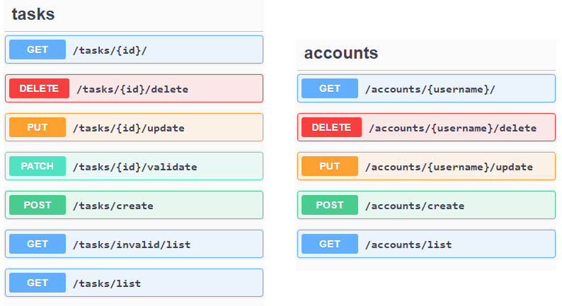

### TASKs and ACCOUNTs API

### TODO

1) Set a production environment similar to the current development environment, but with its specific characteristics and configurations;

2) Improve both setups, make the process more automated;

3) Finish filtering, it is still missing a good implementation regarding PointFields boundaries;

4) Better documentation regarding Postman collection.

### 1. Project Overview

This project aims to provide services to manage a set of `Users` and their `Tasks` with a small background set of business rules;

The project contains different apps, including the ones I created ([account](https://github.com/AndreCajus/TaskManager/tree/master/account) and [taskmanager](https://github.com/AndreCajus/TaskManager/tree/master/taskmanager)),that are based on the Django Rest Framework.

### 2. Get Started

**2.1. Dockers**

a) Open [docker.env](https://github.com/AndreCajus/TaskManager/blob/master/docker-env/dev.env) and change the value of the variable `POSTGRES_HOST` to the machine where the project will run;

b) Run the command: `docker-compose -f docker-compose-dev.yml up`;

c) When finish, on other window, run the command: `docker container restart project_web_1` (verify the web docker container name by using `docker ps -a`);

d) A default admin is created on the process with the `id=useradmin` and the `pw=teste123?Aa`;

e) On browser open `< POSTGRES_HOST >:3000/admin/`, go to `Tokens` and copy the admin token;

f) Use the token on `< POSTGRES_HOST >:3000/swagger/` by clicking at the button  `Authorize` and on postman by inserting the value `Token xxxxxxxxxxxxxxxxxxxxxx` on the [Environment Variables](https://github.com/AndreCajus/TaskManager/blob/master/external_content/dev-ubiwhere-env.postman_environment.json).

**2.2. Local Machine**

Requirements (can vary):

-Python3.8

-PostgreSQL and include postGis with help of the `Stack Builder`

Steps:

a) Create and activate the virtual environment: `python -m venv project_env` , `project_env\Scipts\ativate.bat`;

b) Install the modules present on the file `requirements.txt`;

c) Run something like pgadmin and create a database to map to Django project settings.py;

d) Create superuser: `python manage.py createsuperuser`;

e) At database do: CREATE EXTENSION postgis;

f) Install: https://docs.djangoproject.com/en/3.0/ref/contrib/gis/install/#windows (conflicts: `OSGeo4Wand` and `python` must be both the same version (32 or 64));

g) Verify variable in settings: `GDAL_LIBRARY_PATH = r‘C:\OSGeo4W\bin\gdal300’` (32 bits);

h) Open `http://127.0.0.1:8000/`, get the admin `Token` and place it at Postman.

### 3. Services

 

### 4. Postman

a) At the project structure, I provide the JSONs to set up the API Postman collection and its environment.

b) You should place a valid Token on the [Environment Variables](https://github.com/AndreCajus/TaskManager/blob/master/external_content/dev-ubiwhere-env.postman_environment.json) after creating a user. 

c) After deploying the project, you can use the [Collection](https://github.com/AndreCajus/TaskManager/blob/master/external_content/ubiwhere.postman_collection.json) to test the services.

### 5. Tests

| Accounts                                          | Expected HTTP Response    |
| -------------                                     | -------------             |
| **Create Account**                                | ------------------------- |
| test_create_account_mandatory_parameters          | `HTTP_201_CREATED`        |
| test_create_account_with_some_possibilities       | `HTTP_201_CREATED`        | 
| test_create_account_missing_parameters            | `HTTP_400_BAD_REQUEST`    | 
| test_create_account_wrong_email                   | `HTTP_400_BAD_REQUEST`    | 
| test_create_account_token_correctly_generated     | `HTTP_201_CREATED`        | 
| **Delete Account**                                | ------------------------- |
| test_delete_existing_account                      | `HTTP_200_OK`             |
| test_delete_unexisting_account                    | `HTTP_404_NOT_FOUND`      | 
| test_admin_delete_other_account                   | `HTTP_200_OK`             | 
| test_nonadmin_delete_other_account                | `HTTP_401_UNAUTHORIZED`   | 
| test_delete_account_with_unauthorized_user        | `HTTP_401_UNAUTHORIZED`   | 
| **Update Account**                                | ------------------------- |
| test_put_existing_account                         | `HTTP_201_CREATED`        |
| test_put_existing_account_missing_parameters      | `HTTP_400_BAD_REQUEST`    | 
| test_put_unexisting_account                       | `HTTP_404_NOT_FOUND`      | 
| test_put_existing_account_with_unauthorized_user  | `HTTP_401_UNAUTHORIZED`   | 
| test_put_nonadmin_on_other_accout                 | `HTTP_401_UNAUTHORIZED`   | 
| **View Account**                                  | ------------------------- |
| test_view_existing_account                        | `HTTP_200_OK`             |
| test_view_unexisting_account                      | `HTTP_404_NOT_FOUND`      | 
| test_view_existing_account_with_unauthorized_user | `HTTP_401_UNAUTHORIZED`   | 

 

| Tasks                                             | Expected HTTP Response    |
| -------------                                     | -------------             |
| **Create Tasks**                                  | ------------------------- |
| test_create_task_mandatory_parameters             | `HTTP_201_CREATED`        |
| test_create_task_missing_parameters               | `HTTP_400_BAD_REQUEST`    | 
| test_create_task_wrong_category                   | `HTTP_400_BAD_REQUEST`    | 
| test_staff_create_task_with_state                 | `HTTP_401_UNAUTHORIZED`   | 
| test_admin_create_task_with_state                 | `HTTP_201_CREATED`        | 
| **Delete Tasks**                                  | ------------------------- |
| test_delete_existing_task                         | `HTTP_200_OK`             |
| test_delete_unexisting_task                       | `HTTP_404_NOT_FOUND`      | 
| test_delete_task_with_unauthorized_user           | `HTTP_401_UNAUTHORIZED`   | 
| **Update Tasks**                                  | ------------------------- |
| test_put_existing_task                            | `HTTP_200_OK`             |
| test_put_existing_task_missing_parameters         | `HTTP_400_BAD_REQUEST`    | 
| test_put_unexisting_task                          | `HTTP_404_NOT_FOUND`      | 
| test_put_existing_task_with_unauthorized_user     | `HTTP_401_UNAUTHORIZED`   | 
| test_staff_put_task_with_state                    | `HTTP_401_UNAUTHORIZED`   | 
| test_admin_put_task_with_state                    | `HTTP_200_OK`             | 
| test_staff_put_task_auto_update_state_to_validate | `HTTP_201_CREATED`        | 
| **View Tasks**                                    | ------------------------- |
| test_view_existing_task                           | `HTTP_200_OK`             |
| test_view_unexisting_task                         | `HTTP_404_NOT_FOUND`      | 
| test_view_existing_task_with_unauthorized_user    | `HTTP_401_UNAUTHORIZED`   | 

