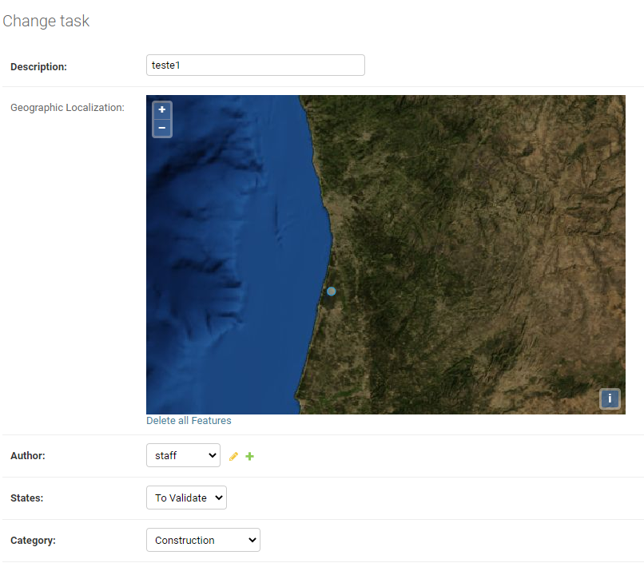
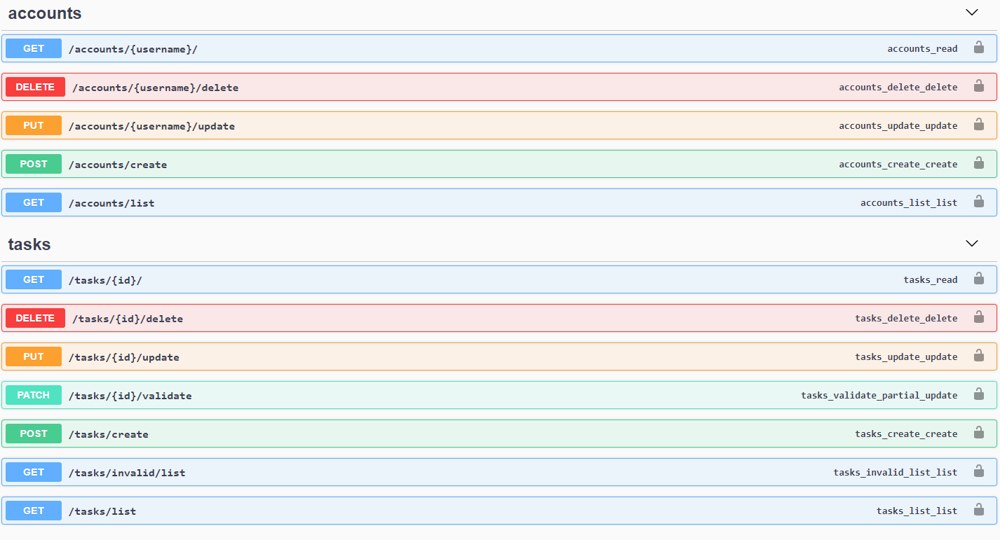

### TASKs and ACCOUNTs API

### Postman

a) At the project structure, I provide the JSONs to set up the API Postman collection and its environment.

b) You should place a valid Token on the [Environment Variables](https://github.com/AndreCajus/TaskManager/blob/master/external_content/dev-ubiwhere-env.postman_environment.json) after creating a user. 

c) After running the API, you can use the [Collection](https://github.com/AndreCajus/TaskManager/blob/master/external_content/ubiwhere.postman_collection.json) to test the services.

### Testes

1) Accounts

| Create Account 			       				| Expected HTTP Response	|
| -------------         						| ------------- 			|
| test_create_account_mandatory_parameters      | HTTP_201_CREATED 			|
| test_create_account_with_some_possibilities   | HTTP_201_CREATED  		| 
| test_create_account_missing_parameters        | HTTP_400_BAD_REQUEST 		| 
| test_create_account_wrong_email          		| HTTP_400_BAD_REQUEST 		| 
| test_create_account_token_correctly_generated | HTTP_201_CREATED 			| 

| Delete Account        						| Expected HTTP Response	|
| -------------         						| ------------- 			|
| test_delete_existing_account      			| HTTP_200_OK 				|
| test_delete_unexisting_account   				| HTTP_404_NOT_FOUND		| 
| test_admin_delete_other_account        		| HTTP_200_OK 				| 
| test_nonadmin_delete_other_account          	| HTTP_401_UNAUTHORIZED 	| 
| test_delete_account_with_unauthorized_user 	| HTTP_401_UNAUTHORIZED 	| 

| Update Account        							| Expected HTTP Response	|
| -------------         							| ------------- 			|
| test_put_existing_account      					| HTTP_201_CREATED 			|
| test_put_existing_account_missing_parameters   	| HTTP_400_BAD_REQUEST		| 
| test_put_unexisting_account        				| HTTP_404_NOT_FOUND 		| 
| test_put_existing_account_with_unauthorized_user  | HTTP_401_UNAUTHORIZED 	| 
| test_put_nonadmin_on_other_accout 				| HTTP_401_UNAUTHORIZED 	| 

| View Account       								| Expected HTTP Response	|
| -------------         							| ------------- 			|
| test_view_existing_account      					| HTTP_200_OK 				|
| test_view_unexisting_account   					| HTTP_404_NOT_FOUND		| 
| test_view_existing_account_with_unauthorized_user | HTTP_401_UNAUTHORIZED 	| 

2) Tasks

| Create Tasks       						| Expected HTTP Response	|
| -------------         					| ------------- 			|
| test_create_task_mandatory_parameters	    | HTTP_201_CREATED 			|
| test_create_task_missing_parameters   	| HTTP_400_BAD_REQUEST		| 
| test_create_task_wrong_category          	| HTTP_400_BAD_REQUEST 		| 
| test_staff_create_task_with_state 		| HTTP_401_UNAUTHORIZED 	| 
| test_admin_create_task_with_state 		| HTTP_201_CREATED 			| 

| Delete Tasks       						| Expected HTTP Response	|
| -------------         					| ------------- 			|
| test_delete_existing_task	    			| HTTP_200_OK	 			|
| test_delete_unexisting_task   			| HTTP_404_NOT_FOUND		| 
| test_delete_task_with_unauthorized_user   | HTTP_401_UNAUTHORIZED 	| 

| Update Tasks       							| Expected HTTP Response	|
| -------------         						| ------------- 			|
| test_put_existing_task	    				| HTTP_200_OK	 			|
| test_put_existing_task_missing_parameters   	| HTTP_400_BAD_REQUEST		| 
| test_put_unexisting_task   					| HTTP_404_NOT_FOUND 		| 
| test_put_existing_task_with_unauthorized_user | HTTP_401_UNAUTHORIZED 	| 
| test_staff_put_task_with_state   				| HTTP_401_UNAUTHORIZED 	| 
| test_admin_put_task_with_state   				| HTTP_200_OK 				| 
| test_staff_put_task_update_state_to_validate  | HTTP_201_CREATED 			| 

| View Tasks       									| Expected HTTP Response	|
| -------------         							| ------------- 			|
| test_view_existing_task	    					| HTTP_200_OK	 			|
| test_view_unexisting_account   					| HTTP_404_NOT_FOUND		| 
| test_view_existing_account_with_unauthorized_user | HTTP_401_UNAUTHORIZED 	| 

### Images
 

 

 
