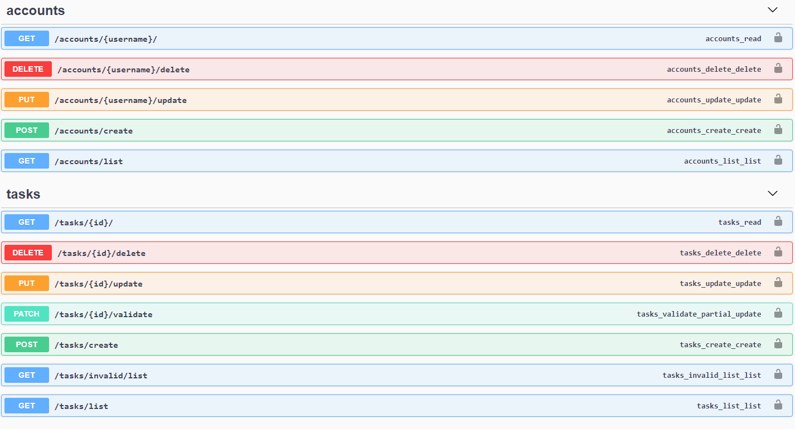

### TASKs and ACCOUNTs API

### Postman

 

a) At the project structure, I provide the JSONs to set up the API Postman collection and its environment.

 

b) You should place a valid Token on the [Environment Variables](https://github.com/AndreCajus/TaskManager/blob/master/external_content/dev-ubiwhere-env.postman_environment.json) after creating a user. 

 

c) After running the API, you can use the [Collection](https://github.com/AndreCajus/TaskManager/blob/master/external_content/ubiwhere.postman_collection.json) to test the services.

 

### Images

 

a) Register Models - admin

b) Task content - admin

c) Swagger
