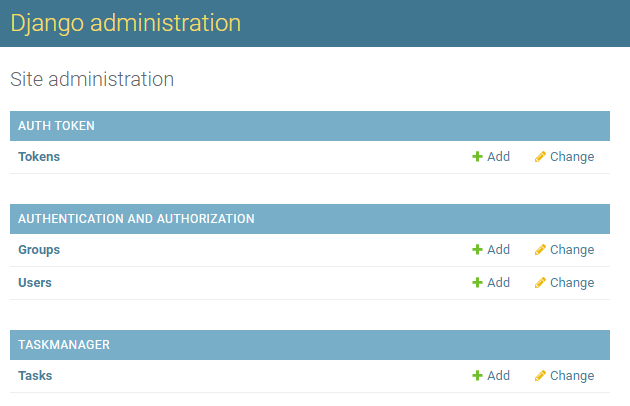
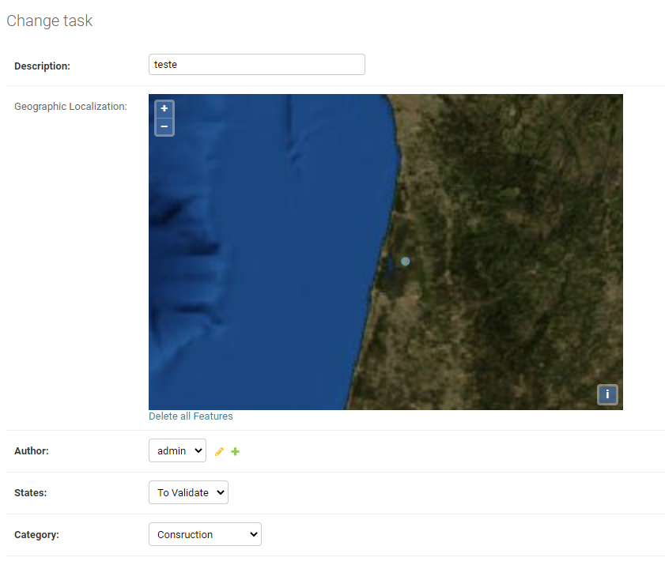
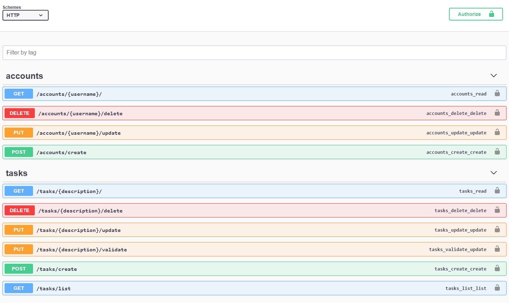

### TASKs and ACCOUNTs API

### Postman

env) [a link](https://github.com/user/repo/blob/branch/other_file.md)

collection) [a link](https://github.com/user/repo/blob/branch/other_file.md)

### Images

1) Register Models - admin

2) Task content - admin

3) Swagger
